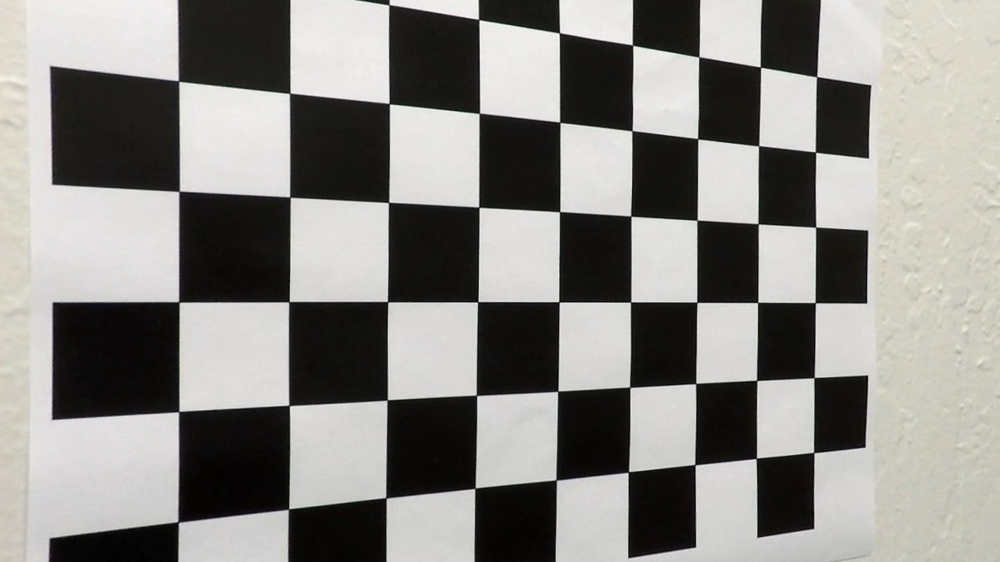
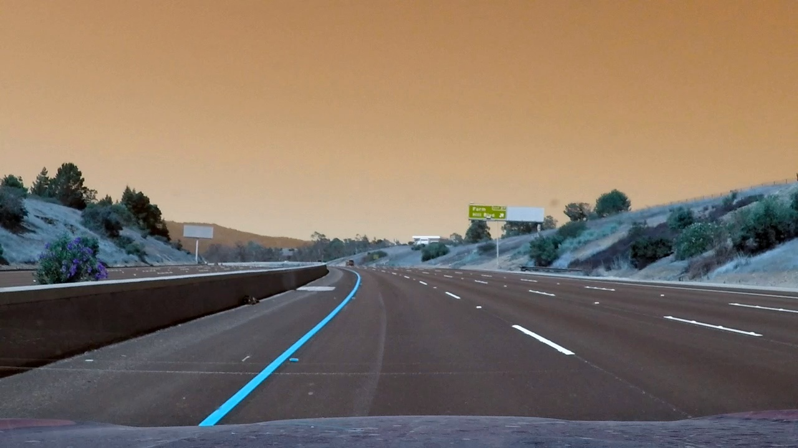
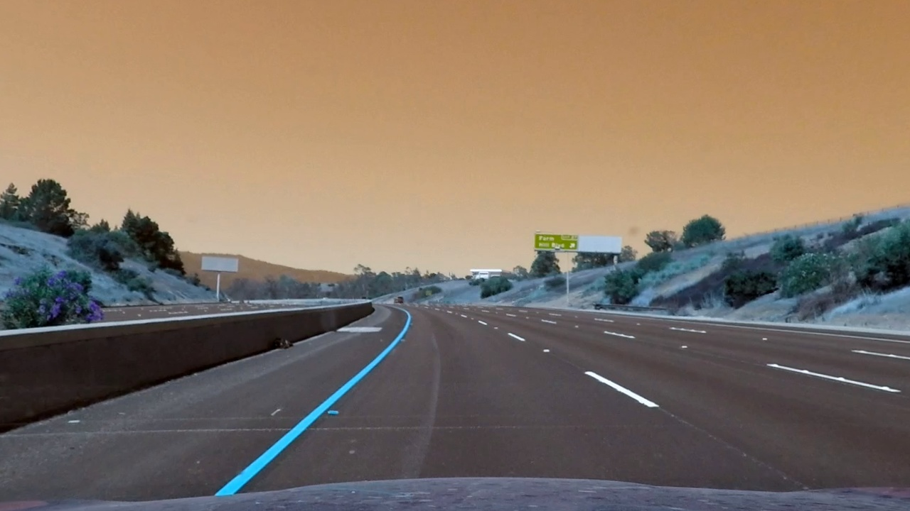
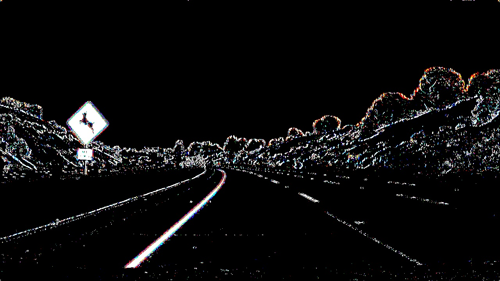
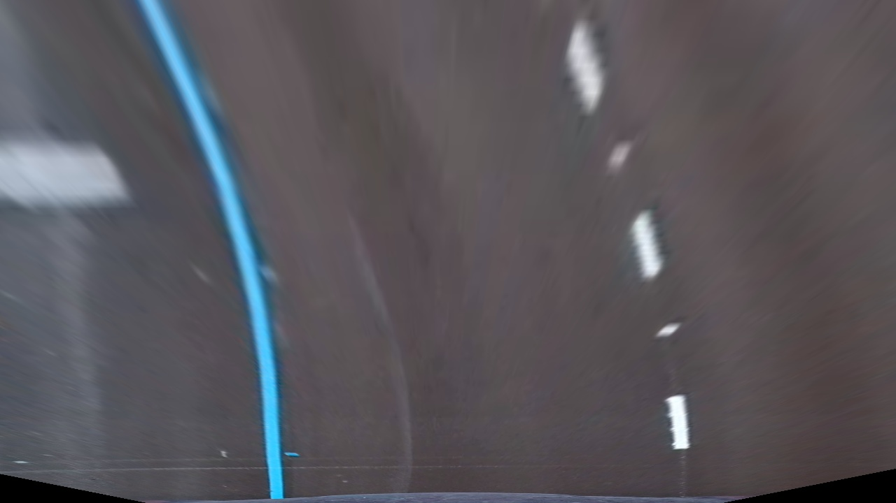
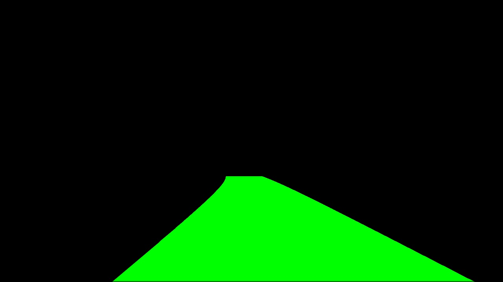
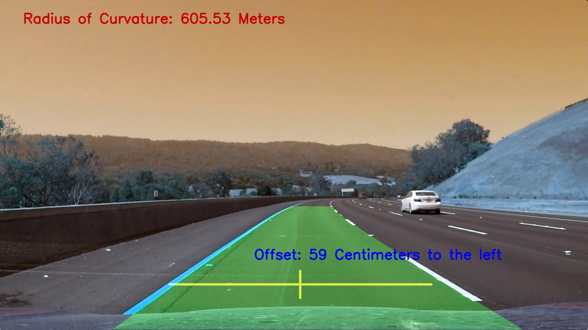

**Advanced Lane Finding Project**

The goals / steps of this project are the following:

* Compute the camera calibration matrix and distortion coefficients given a set of chessboard images.
* Apply a distortion correction to raw images.
* Use color transforms, gradients, etc., to create a thresholded binary image.
* Apply a perspective transform to rectify binary image ("birds-eye view").
* Detect lane pixels and fit to find the lane boundary.
* Determine the curvature of the lane and vehicle position with respect to center.
* Warp the detected lane boundaries back onto the original image.
* Output visual display of the lane boundaries and numerical estimation of lane curvature and vehicle position.


---
For this project I have not used an IPython notebook. Instead, there is a python code file 'Advanced_lane.py', where all the coed is written.

### Camera Calibration

#### 1. Briefly state how you computed the camera matrix and distortion coefficients. Provide an example of a distortion corrected calibration image.

The Calibration is done using the provided images by function 'calibrate' in Line 88 of the code. The calibration data is stored after the first time, and is loaded thereafter.

The following is essentially what I did in "calibrate"; it was in the template and I did not change it. 

I start by preparing "object points", which will be the (x, y, z) coordinates of the chessboard corners in the world. Here I am assuming the chessboard is fixed on the (x, y) plane at z=0, such that the object points are the same for each calibration image.  Thus, `objp` is just a replicated array of coordinates, and `objpoints` will be appended with a copy of it every time I successfully detect all chessboard corners in a test image.  `imgpoints` will be appended with the (x, y) pixel position of each of the corners in the image plane with each successful chessboard detection.  

I then used the output `objpoints` and `imgpoints` to compute the camera calibration and distortion coefficients using the `cv2.calibrateCamera()` function.  I applied this distortion correction to the one of the test images using the `cv2.undistort()` function and obtained this result: 



### Pipeline (single images)

#### 1. Provide an example of a distortion-corrected image.

To demonstrate this step, I will describe how I apply the distortion correction to one of the test images like this one:



In 'Advanced_lane.py', Line 242 calls function 'undistort', which loads teh calibration data and calls 'cv2.undistort()' to undistort the image:



#### 2. Describe how (and identify where in your code) you used color transforms, gradients or other methods to create a thresholded binary image.  Provide an example of a binary image result.

I used a combination of color and gradient and direction thresholds to generate a binary image. Except for the single images where I utilizied all these thresholds, for most of the visdeo only two of them, S channel and R channel thresholds where used. For more challenging scenarios I used channel V and sobel x and y thresholds as well. To do this I got ideas over internet, but mostly through trial and error decieded to choose which over which. Here's an example of my output for this step:



#### 3. Describe how (and identify where in your code) you performed a perspective transform and provide an example of a transformed image.

The code for my perspective transform includes a function called `warp()`, which appears in lines 389 through 400 in the file `Advanced_Lane.py` (code/Advanced_Lane.py).  The `warp()` function takes as inputs an image (`img`), as well as source (`src`) and destination (`dst`) points.  I have written a helper function 'get_warp_params()' that kinda works as information provider for'warp()'. 'warp' gets called in Line 292 in the pipeline function. 

And here is the codes for these two functions.

```python
def get_warp_params(img):


    src_corners=[[595,450],[690,450],[200,img.shape[0]],[1140,img.shape[0]]]#,

    #short, not working for all
    #src_corners=[[449,550],[857,550],[200,img.shape[0]],[1140,img.shape[0]]],

    # # another
    #src_corners= [[552,480],[740,480],[200,img.shape[0]],[1140,img.shape[0]]]

    dst_x1=340

    dst_x2=940

    dst_corners=[[dst_x1 ,0],[dst_x2,0],[dst_x1,img.shape[0]],[dst_x2,img.shape[0]]]

    src = np.float32(src_corners)
    
    dst = np.float32(dst_corners)

    lines = [[[dst_x1 ,0, dst_x1,img.shape[0]],[dst_x2,0,dst_x2,img.shape[0]]]]

    return src, dst, lines
    

def warp(img, src=None, dst=None):
    
    if not (src and dst):
        src, dst, lines = get_warp_params(img)

    M = cv2.getPerspectiveTransform(src, dst)
    
    warped = cv2.warpPerspective(img, M, img.shape[:2][::-1], flags=cv2.INTER_LINEAR) 


    
    return warped, M,lines
```

One source and destination points set that I used is(for variable references refer to the above code):

| Source             | Destination                    | 
|:------------------:|:------------------------------:| 
| [595,450]          | [dst_x1 ,0]                    | 
| [690,450]          | [dst_x2,0]                     |
| [200,img.shape[0]  |[dst_x1,img.shape[0]]           |
| [1140,img.shape[0]]| [dst_x2,0,dst_x2,img.shape[0]] |

I verified that my perspective transform was working as expected by drawing the `src` and `dst` points onto a test image and its warped counterpart to verify that the lines appear parallel in the warped image.

See an example:



#### 4. Describe how (and identify where in your code) you identified lane-line pixels and fit their positions with a polynomial?

This was probably one of the most challenging parts, which in Line 304 of the pipeline is done by calling 'fit_polynimial'. In particular for the harder challenge(which eventually did not result in very good result but acceptable). Using the class 'Lane'in Line 27 and its two left and right line objects which where instances of the 'Line' class in Line 43, I was keeping track of the successes and failures in fitting the curves. Whenever it was not possible for the algorithm to find the next frame's lines by searching around the current found lines(function 'search_around_poly' in Line 504), the algorithm would reset by calling 'find_lane_pixels'  in Line 431 to find them through window searching. The criteria to be met for doing this reset, done in the if, elif, else statement between Lines 584 to 604,  is determined by a myriad of decision_factor variables between lines 558 to 579, where concavity, parallelism, change from the previous lines , etc, are measured. 

A history of fitted polynomials are stored in the field 'recent_fits' of the Line class, to smoothen the find curves throughout the process. The 'recent_fits' field was set to store the last four fittings.

Later in the pipline, warp_back warps back the filled polygon of the found curves to be shadowed over the original image, in Line 342 of the pipeline function, by calling 'shadow_mix' which blends two images using 'cv2.addWeighted'. See here:



#### 5. Describe how (and identify where in your code) you calculated the radius of curvature of the lane and the position of the vehicle with respect to center.

See Line 622, function 'measure_curvature_pixels'. Pretty straight forward. Just convert the values from the pixel space to the world, and claculate the cure in Lines 634 and 635 using the formula.

#### 6. Provide an example image of your result plotted back down onto the road such that the lane area is identified clearly.

This is done in the rest of the pipeline function, Lines 315 to 352. Here is an example of my result on a test image:



---

### Pipeline (video)

#### 1. Provide a link to your final video output.  Your pipeline should perform reasonably well on the entire project video (wobbly lines are ok but no catastrophic failures that would cause the car to drive off the road!).

Same pipeline is called in Line 679 for each image of the video.  Here's a [link to the project video](./code/project_video_processed.mp4), [to the challenge video](./../challenge_video_processed.mp4) and [the brutal challenge](./../harder_challenge_video_processed.mp4) video.

---

### Discussion

#### 1. Briefly discuss any problems / issues you faced in your implementation of this project.  Where will your pipeline likely fail?  What could you do to make it more robust?

I'm pretty satisfied with the results, except for the harder challenge. I think that one needs more complicated methods allong probably with a classifier, that classifes the scence, or the road, and then accordingly the algorithm decised how to, and using which thresholds and parameters, to operate. 

Sensor fusion, with probably gps, even odometry information such as travled distance or speed can improve the results a lot.
